Hello IOT project

# Description

## Goal:

Connected movement detector

## Tools:

ESP8266, Raspberry PI, PIR sensor, PlatformIO (VSCode), C++, MQTT (Mosquitto), Node-RED, Networking, Let's Encrypt, Certbot

## Architecture:

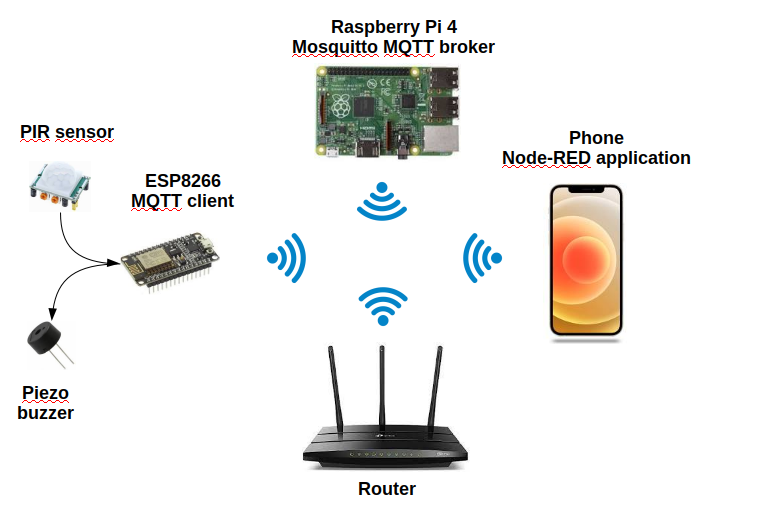

## Nominal scenario:

1- ESP8266 detects movement via PIR sensor

2- Node-RED application is notified via MQTT protocol

3- App's user can toggle the buzzer

# Work-packages

## ESP8266:

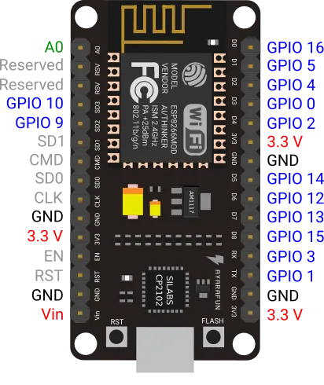

The ESP8266 ship has a TCP/IP stack with WLAN 802.11b/g/n as physical and MAC layer. In the context of the project, the board is used to wirelessly provide the inputs state to other MQTT clients and set outputs state retrieved via MQTT.

### Hardware:

Connections are classic.

*Note:*

- Voltage: ESP8266 is not 5V TTL level compatible. Fortunately, the PIR sensor output is 3.3V compatible.
- Current: ESP8266 NodeMCU board provides 12 mA of current to draw per GPIO and 72 mA in total.

### Software:

Code is written under an MIT license with re-usability and performance in mind. Feel free to use, copy and modify it :).

*Source files structure:*

|-include : application headers

|---app_config.h : app configuration

|---app_io.h : app inputs/outputs header

|-src : application sources

|---main.cpp : main thread

|---app_config.cpp : configuration functions

|---app_io.cpp : app inputs/outputs sources

|-lib : private libraries

1- *Public Libraries:*

- On VSCode, add PubSubClient library to the project:
    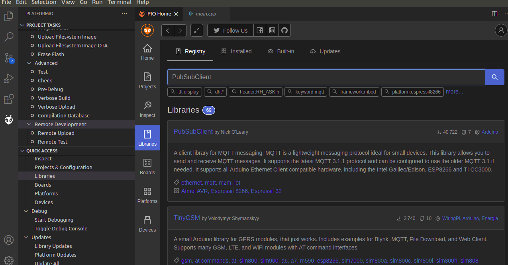
    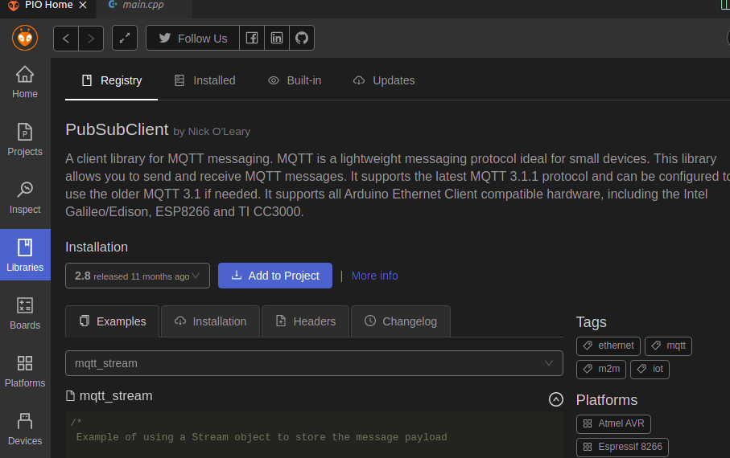
- Add ESPAsyncTCP-esphome library:
    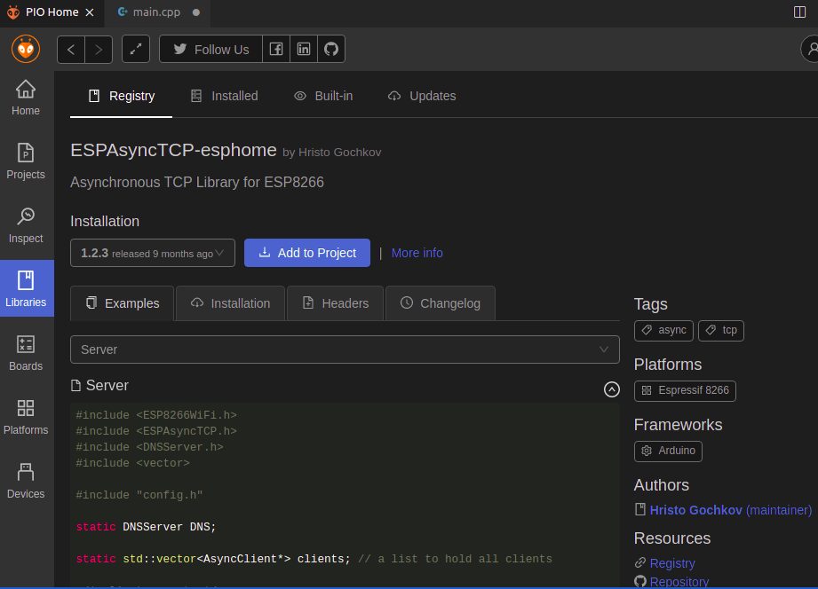

2- *Private Libraries:*

- wifi\_client: encapsulate wifi client setup according to the parameters defined in the app\_config.h header.
- mqtt\_client: helps configure mqtt client according to app\_config.h. Topics to subscribe to and their callbacks are declared and defined in the app_config sources.
- utils: serialisation helpers for now.

*Note :* The private libraries are compiled first to static libraries. To include the app_config.h, i have added a build's cflags in each library's configuration file (library.json).

Feel free to check the sources.

## RaspberryPI:

A powerful single board computer who will run an MQTT broker (centralised manager of subscription and publishing to topics).

### Hardware:

Power the board and connect an RJ45 between the rasp and the computer to configure it in headless mode.

### Software:

RaspOS is used as OS.

1- *Network:*
Ethernet and wlan connections are configured in headless using /etc/network/interfaces file (written directly to the SD card):

```
auto eth0
iface eth0 inet static
  address static-ip

auto wlan0
iface wlan0 inet dhcp
  wpa-ssid "ssid"
  wpa-psk "passwd"
```

*Note:* NetworkManger can be used via nmtui gui for wlan connection. Ethernet should be configured before if running headless. wpa_supplicant is also an option if an encryption of wpa-password is required.

2- *MQTT broker:*

To install Mosquito broker:

```bash
$ sudo apt update
$ sudo apt install -y mosquitto mosquitto-clients
$ sudo systemctl enable mosquitto.service
```

To check if the installation is well-done:

```bash
$ mosquitto -v
```

Return:

```
1620593230: mosquitto version 1.5.7 starting
1620593230: Using default config.
1620593230: Opening ipv4 listen socket on port 1883.
1620593230: Error: Address already in use
```

3- *MQTT Node-RED client:*
Node-RED permit running an MQTT client in the raspberry that will serve a responsive web interface to

```
http://RASP_IP_ADDRESS:1880/ui
```

for interaction with the application user. The interface is configurable using flows of nodes (in a scratch look-alike way):
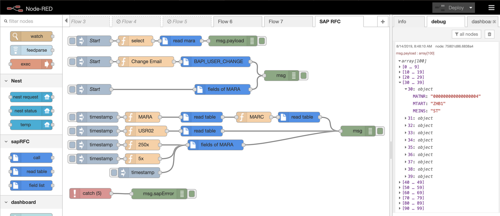

The configured Node-RED MQTT client will connect to the broker in order to publish data generated by the web interface, and subscribe to topics to retrieve data.

To install Node-RED in the raspberry pi:

```
bash <(curl -sL https://raw.githubusercontent.com/node-red/linux-installers/master/deb/update-nodejs-and-nodered)
```

To auto-start Node-RED at boot time:

```bash
$ sudo systemctl enable nodered.service
```

After reboot, the MQTT client can be configured by accessing http://RASP\_IP\_ADDRESS:1880 from the computer browser (make sure it is connected to the raspberry):

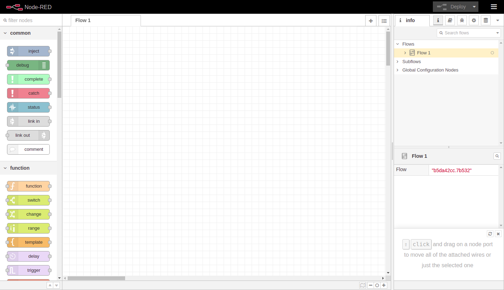

To add a nice dashboard to the served web page, Node-RED dashboard needs to be installed:

```bash
$ node-red-stop
$ cd ~/.node-red
$ npm install node-red-dashboard
```

A simple ui is configured and deployed using the Node-RED. When presence is detected, a notification pops up with text to speech audio. To do so the following flow is used (available in the repo):

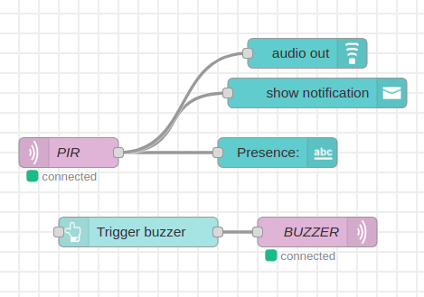

The resulting ui is the following:

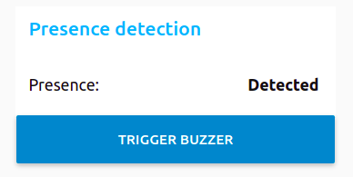

As you can see, Node-RED is an intuitive and powerful tool to use when rapid automation is needed.

## User authentication:

To enable username/password based authentication of the users who can configure and deploy our server, the settings file ~/.node-red/settings.js is used. The following section is uncomment and modified:

```
adminAuth: {
    type: "credentials",
    users: [
            {
        username: "username",
        password: "password",
        permissions: "*"
    }
    ]
},

```

The password should be hashed using the interactive command:

```bash
node-red admin hash-pw
```

To authenticate the dashboard user, the next line is uncomment and modified:

```
httpNodeAuth: {user:"username",pass:"$2a$08$zZWtXTja0fB1pzD4sHCMyOCMYz2Z6dNbM6tl8sJogENOMcxWV9DN."},
```

## Connection from outside the local LAN:

To access the ui served by Node-RED, the device needs to be connected to the local LAN and access http://RASPI\_IP\_ADDRESS:PORT/ui. The goal at this stage is to connect to the server from outside the LAN.

### Port forwarding, Dynamic public IP and DNS:

Devices connected to Internet via a LAN have local IP addresses. The router though have a public IP address accorded by the ISP (internet service provider). Hence, if a local device wants to connect to internet, the router routes the device packets using its public address and routes back the response to the device using NAT (network address translation). Hence, Internet does not know about our local devices and can't "ping" them.

The public IP address of the router is dynamic. The ISP provides the router with a public IP that may change at the router disconnection/re-connection or periodically. Since static IP addresses are limited, this technique helps providing a much bigger number of clients with public IP addresses.

As explained, Internet have access to the router but not the local devices. To provide the outside world access to a service running in a local machine, port forwarding is used. It consists in linking a router's port to the local service (local IP address + port).

To access our server from outside, it is not convenient to enter the public IP address and port in a browser. Specially when IP changes. A DNS (domain name server) is used to register our public IP as domain name. So we can access the service using an URL address. The URL address is translated to an IP address via the DNS server. The port number is deduced from the url protocol (https=443, http=80...).

To do so, DuckDNS is used to register our public IP address. By running a script in the raspberry, DuckDNS keep track of the changing public address of the router. The cited video in documentation explains well how to use DuckDNS.

After configuring router's port-forwarding and DucKDNS, we can access our Node-RED server using an URL: http://domain-name.duckdns.org/ui. The http communication is not encrypted. Which means a black-hat can sniff packets between the http client and server. Login credentials of the clients can then be leaked. What about https?

### HTTPS connection:

To secure the connection between the http client (web browser) and server (Node-RED server), a TLS 1.3 tunnel needs to be setup (https connexion). Hence, the communication will be encrypted and prevent outsiders from leaking login credential and configuring our Node-RED server (authentication while login to Node-RED client cannot be sniffed or middle-man attacked).

As a result of the encryption technique (asymmetric encryption) and as explained in the attached video about TLS encryption, the server needs to certify its public key by a trusted third party (CA: certification authority) to validate that the provided service is running in a trusted machine. Hence, prevent middle-man attacks (impersonate the server's public key).

To configure the TLS encryption, the most complex part is requesting a certificate of the server's public key (Certificate Signing Request). Once our public key is certified, Node-RED can be configured to use those certificates for the handshake with client.

Let's encrypt is a CA that simplify the CSR operation. Let's encrypt associate a certification with the domain name and validate that the server pointed by the domain name is running in the machine.

BartButenaers (github: https://github.com/bartbutenaers) explained well the magic behind Let's encrypt and ACME protocol in his answer to loan Feb 20 (https://discourse.nodered.org/t/node-red-ssl-using-letsencrypt-certbot/17606/27):

* * *

- When you request a new certificate for a domain (mydomain.com), the guys from Letsencrypt have to be sure that you are the owner of domain.com. Otherwise everybody could request a certificate, which means it wouldn't be secure anymore ...

To make sure you are the owner, they will send a token to the acme client (in your case Certbot) and that client needs to make that token available on port 80 of the domain:

1-Certbot sends a certificate request to Letsencrypt. Letsencrypt returns a token that Certbot needs to make available on port 80.

2-Letsencrypt will try to get the token via port 80. If it succeeds, you will get your certificate.

The reason they use port 80 (or 443) is that you need to be administrator (or root user) to listen to port 80 on any system. So only the administrator (who controls the server) has access to it. That way they know they are talking to someone that controls the domain. And that is also the reason that they don't allow redirects to other ports (to avoid cheating)!

So I 'think' that if you should install certbot on your RPI, and you forward port 80 of your domain to port 80 of your RPI, then I assume it should also work...

- Once you have received your Letsencrypt certificate, that certificate should be used by your webserver when you connect to Node-RED:

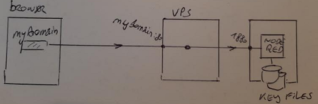

You navigate to your mydomain.com from your browser. Even when Node-RED is running on your RPI (and the certificate is stored into your key files there), it doesn't matter for your browser. Your browser receives a certificate, and inside the certificate the domain name is mydomain.com. Your browser sees that the domain inside the certificate matches the domain name you have entered in the browser's address bar, so the certificate is marked as valid ...

* * *

According to BartButenares, Thanks to whom a node for Node-RED is available to do the exact same thing we doing here more easily (https://github.com/bartbutenaers/node-red-contrib-letsencrypt), Certbot needs to use port 80 instead of 1880 to ensure that a user with root privileges is running the server. To avoid running Node-RED as root for safety reasons, i tried to redirect port 80 to port 1880 using iptables:

```
sudo iptables -A PREROUTING -t nat -i wlan0 -p tcp --dport 80 -j REDIRECT --to-port 1880

```

This was not helpful to retrieve a certificate from Let's encrypt using CertBot. It fails due to unauthorised access, which means the local port redirection did not resolve the issue. To go forward, i decided to use an nginx reverse proxy with Node-RED.

### Securing MQTT broker:

To prevent unidentified clients to connect to the broker, Mosquitto broker can ask for the client's credentials to establish a connection. To do so, mosquitto.conf file is used.

The first step is to create a usernames:passwords file (login_credentials):

```
username1:password1
username2:password2
```

To encrypt the passwords:

```bash
$ mosquitto_passwd -U login_credentials
```

Check the passwords encryption in the given file.

To add a username:password to the file:

```bash
$ mosquitto_passwd -b login_credentials username3 password3
```

Then copy the passwords file to /etc/mosquitto and create a config file (default.conf) in /etc/mosquitto/conf.d/ where next two lines are placed:

```
allow_anonymous false
password_file [directory to password file]
```

The broker should restart:

```
sudo systemctl restart mosquitto
```

To enter credentials of the Node-RED MQTT client that turns in the raspberry, the MQTT topics configuration in Node-RED interface is used:
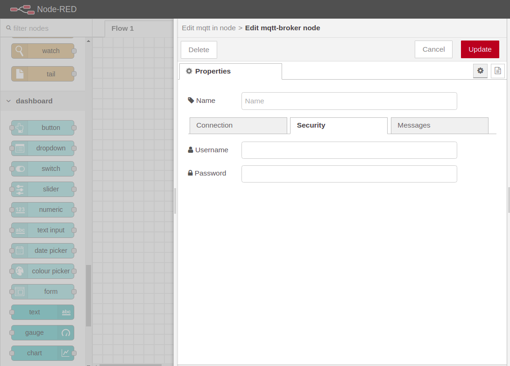

*Note:*
Since the MQTT client turns locally, no need for the TLS encryption in the MQTT segments transport side (data can be sniffed in the lacol LAN). This previous authentication prevents unidentified MQTT client to connect to the broker once its IP address becomes public (via port forwarding, see next).

# Documentation

**Used links:**
1- Inspiration project: https://randomnerdtutorials.com/esp8266-and-node-red-with-mqtt/

2-PIR sensor:
[https://create.arduino.cc/projecthub/electropeak/pir-motion-sensor-how-to-use-pirs-w-arduino-raspberry-pi-18d7fa#:~:text=Using a PIR Sensor with Arduino&text=You can connect PIR output,a jumper behind this module.&text=Moving the jumper to the,the last motion is detected](https://create.arduino.cc/projecthub/electropeak/pir-motion-sensor-how-to-use-pirs-w-arduino-raspberry-pi-18d7fa#:~:text=Using%20a%20PIR%20Sensor%20with%20Arduino&text=You%20can%20connect%20PIR%20output,a%20jumper%20behind%20this%20module.&text=Moving%20the%20jumper%20to%20the,the%20last%20motion%20is%20detected).

3- MQTT configuration in NodeRed:
http://stevesnoderedguide.com/configuring-the-mqtt-publish-node

4- VLANS setting:
https://www.youtube.com/watch?v=6wcbkE3TF3c

4- Secured MQTT connexion to broker:
http://www.steves-internet-guide.com/mqtt-username-password-example/

5- TLS encryption of MQTT messages:
https://discourse.nodered.org/t/mqtt-tls-encryption-example/17691

6- SSL/TLS explained:
https://www.youtube.com/watch?v=-f4Gbk-U758

7- HTTPS securing of Node-RED: https://nodered.org/docs/user-guide/runtime/securing-node-red

8- Let's Encrypt Certificates Authority:
https://it.knightnet.org.uk/kb/nr-qa/https-valid-certificates/

9- DuckDNS, Let's Encrypt :
https://www.youtube.com/watch?v=BIvQ8x_iTNE

10- Let's encrypt, certbot:
https://certbot.eff.org/lets-encrypt/pip-other

11- https://github.com/bartbutenaers/node-red-contrib-letsencrypt

# TODO:

- [ ] Nginx reverse proxy + ACME
- [ ] Docker for seperate env for reverse proxy and Node-RED
